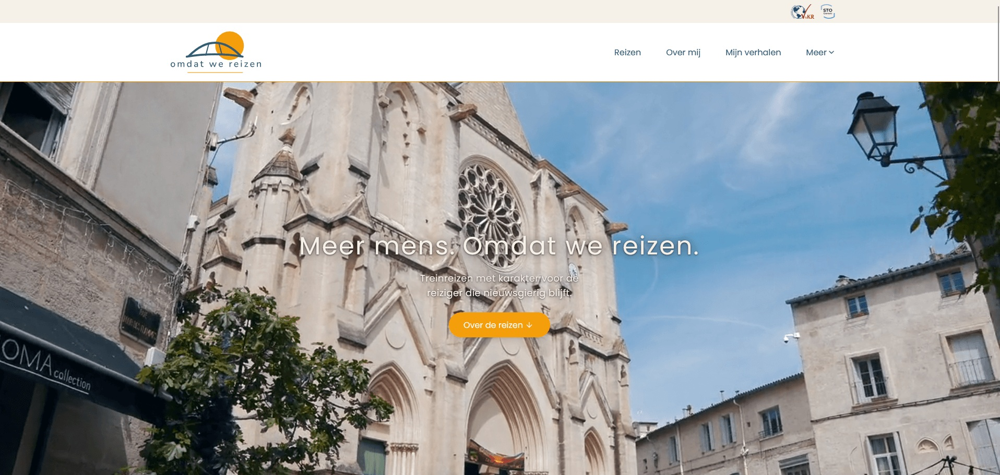
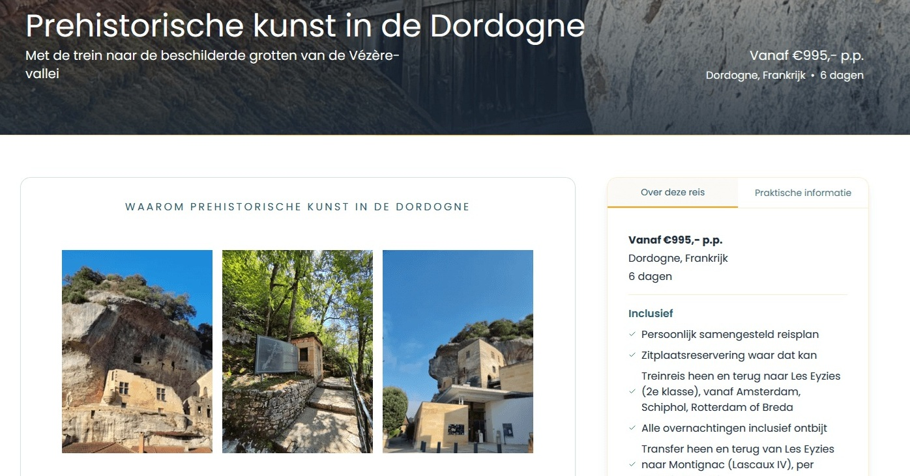
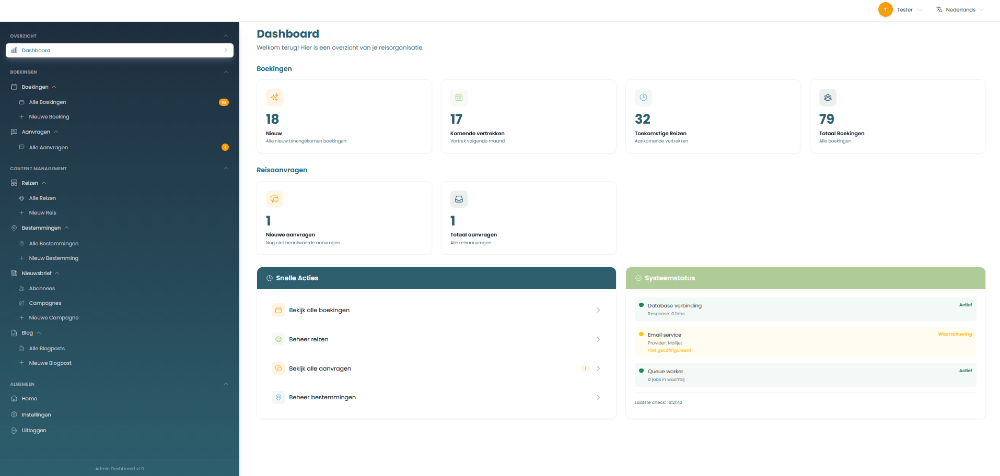
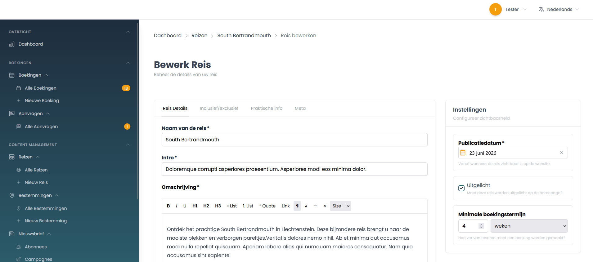
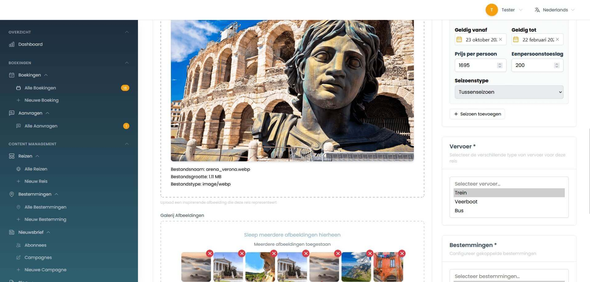
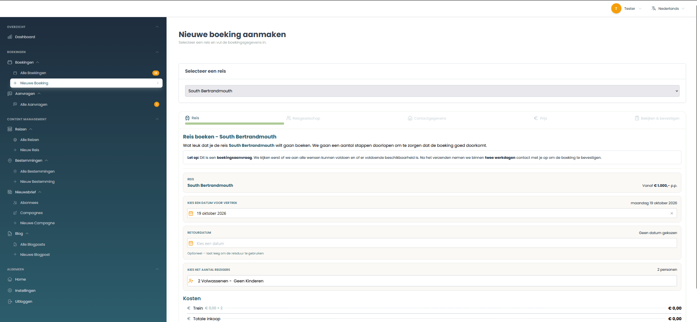

# Omdat We Reizen: Sustainable Travel Agent

[](https://github.com/dejong-jelmer/travel-agent/actions/workflows/run-tests.yml)
[](https://github.com/dejong-jelmer/travel-agent/actions/workflows/lint.yml)

A Laravel 12 + Inertia.js + Vue 3 application promoting sustainable European train travel. It combines a public Dutch website with a bilingual admin panel, and runs in production on Laravel Forge.

> **Mission**: Making slow travel the standard for European trips through curated, culturally rich train-based journeys with minimal carbon footprint.

**Live site:** https://omdatwereizen.nl · **Built by:** Jelmer de Jong, solo, from first commit (February 2025) to production

<p align="center">
  
  
</p>
<p align="center">
  
  
</p>
<p align="center">
  
  
</p>

## Tech Stack

| Layer                  | Technology     | Version |
| ---------------------- | -------------- | ------- |
| **Backend**            | Laravel        | 12      |
| **Language**           | PHP            | 8.4     |
| **Database**           | MySQL          | 8.0+    |
| **Frontend Framework** | Vue.js         | 3.5     |
| **SPA Bridge**         | Inertia.js     | 2.0     |
| **Styling**            | Tailwind CSS   | 3.4     |
| **Build Tool**         | Vite           | 6       |
| **PHP Testing**        | PHPUnit        | 11      |
| **JS Testing**         | Vitest         | 4       |
| **Email Service**      | Mailjet API    | 3.1     |
| **CI**                 | GitHub Actions | -       |
| **Hosting**            | Laravel Forge  | -       |

## Features

### Public website

- **Trip browsing** - Curated European train journeys with itineraries, images and practical information
- **Trip requests** - Multi-step request form with real-time validation and price indication
- **Blog** - Travel stories with rich text content and published or draft states
- **Newsletter subscriptions** - Double opt-in with token-based confirmation links
- **Informational pages** - About, guarantee, VvKR membership, privacy and terms
- **PDF downloads** - Terms and sustainability documents generated on the server
- **Responsive design** - Mobile-first UI with custom breakpoints

### Admin panel

- **Dashboard** - Counters for new bookings and new trip requests, plus a system status overview
- **Trip management** - Trips, prices, itineraries, destinations, trip items and image ordering
- **Booking management** - Bookings, travelers, contacts, cost items and change history
- **Trip request handling** - Follow up on incoming requests with status tracking
- **Blog post management** - Create, edit and publish posts
- **Newsletter campaigns** - Compose, test-send and dispatch campaigns to subscribers
- **Settings** - Key-value application settings shared with the frontend

## Installation

Requires PHP 8.4, Composer, Node.js 20+ and MySQL 8.

```bash
git clone https://github.com/dejong-jelmer/travel-agent.git
cd travel-agent
composer install
npm install
cp .env.example .env
php artisan key:generate
# Fill in APP_URL, the database and the Mailjet credentials in .env
php artisan migrate --seed
composer dev
```

`composer dev` runs the Laravel server, a queue worker and the Vite dev server concurrently. `APP_URL` matters more than it looks: Ziggy, the sitemap and every absolute URL in outgoing email are built from it.

## Testing

```bash
php artisan test
npm run test:run
```

The PHP tests run against MySQL, not SQLite, so a local database named `laravel_test` has to exist.

## Architecture

Requests follow a fixed path through the backend:

```
HTTP Request
  → FormRequest (validation)
  → DTO (type-safe data)
  → Service (business logic)
  → Model (persistence)
  → ResponseMacro (formatted response)
```

- **Backend**: Form Requests validate input, DTOs in `app/DTO/` carry it, and services in `app/Services/` hold the business rules. Transactional email is driven by events and queued listeners.
- **Frontend**: Inertia pages in `resources/js/Pages/`, built from components organized by atomic design (atoms, molecules, organisms). Shared state and logic live in composables.
- **Routing**: The public site uses Dutch URLs. The admin panel lives under `admin/` behind authentication and an admin role check.

See [docs/architecture.md](docs/architecture.md) for the backend in detail and [docs/frontend.md](docs/frontend.md) for components, composables and the Tailwind theme.

## Security

- **Access**: Session authentication for the admin panel, restricted to admin users, Sanctum tokens for the API routes and CSRF protection on all state-changing requests.
- **Validation** on both server and client, with shared rule sets per domain and country-specific phone validation.
- **Abuse protection**: Rate limiting on public forms, login and downloads, honeypot fields and obfuscated email addresses and phone numbers.
- **Secrets** live in environment variables, managed in Forge and GitHub Secrets, never in the repository.
- **Privacy**: Token-based newsletter links and scheduled anonymization of old bookings and special requests.

## Development Workflow

I build and maintain this project on my own:

1. Each change starts on a feature branch off `main`.
2. Before committing I run the tests, Pint and PHPStan (Larastan level 5) locally.
3. Commit messages follow the conventional commits style (`feat:`, `fix:`, `refactor:`).
4. A pull request against `main` runs the same checks in CI, plus an automated AI review.
5. A release is a pull request from `main` to `production`, which Forge deploys. See [docs/deployment.md](docs/deployment.md).

Code, comments and docblocks are written in English. User-facing strings live in translation files, never hardcoded.

## Further Documentation

- [Architecture](docs/architecture.md) - DTOs, services, events, response macros, routing and configuration
- [Frontend](docs/frontend.md) - Component structure, composables, breakpoints, fonts and color palette
- [Deployment](docs/deployment.md) - Release pipeline, Forge deploy script, server processes, console commands and scheduled tasks
- [SEO](docs/seo.md) - Meta tags, structured data, Open Graph images and the sitemap
- [Localization](docs/localization.md) - Dutch public site and bilingual admin panel
- [Troubleshooting](docs/troubleshooting.md) - Common local, CI and production issues

## License

Copyright © 2025 Jelmer de Jong. All rights reserved.

This repository is public so the code can be read and reviewed. No license is granted to copy, modify, distribute or use it, in whole or in part, without prior written permission.
